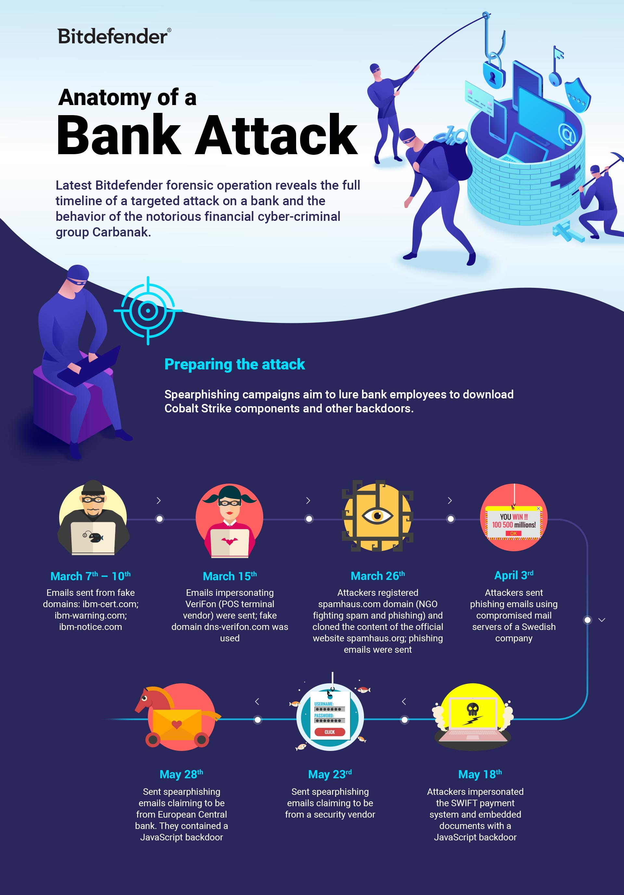
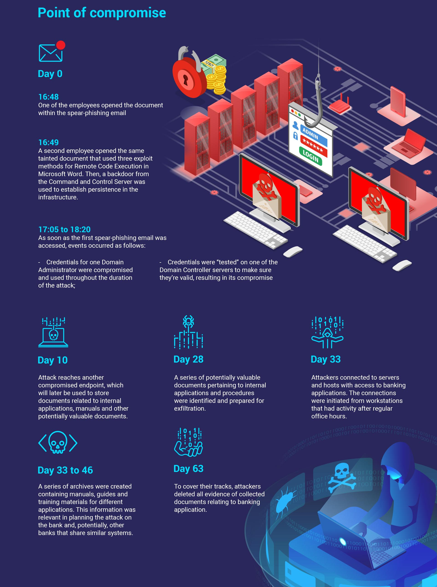

# Anatomy of a Bank Hack

This is the description of a timeline of a notorious cybercriminal group known as Carbanak that specifically targets the financial sector as investigated by Bitdefender

Goal here is to show domain admin \(DA\) can also be obtained by nefarious groups for financial gain.  The final goal of the targeted attack was to compromise the ATM networks, potentially to cash out at ATMs in a coordinated physical and infrastructure criminal operation

1. Spearphing emails send from believable domains.
2. Remote Code Execution triggered by attached Microsoft Word documents when emails opened.  
3. After the initial foothold network was mapped and credentials for at least one Domain Administrator was compromised.
4. Numerous workstations were systemically compromised in a search for critical information on banking software.
5. A series of potentially valuable documents pertaining to internal applications and procedures were identified and exfiltrated.
6. Hosts with access to banking applications was access by the attackers.
7. Millions pilfered through coordinated ATM withdrawals. 

[https://labs.bitdefender.com/2019/06/an-apt-blueprint-gaining-new-visibility-into-financial-threats/](https://labs.bitdefender.com/2019/06/an-apt-blueprint-gaining-new-visibility-into-financial-threats/)

